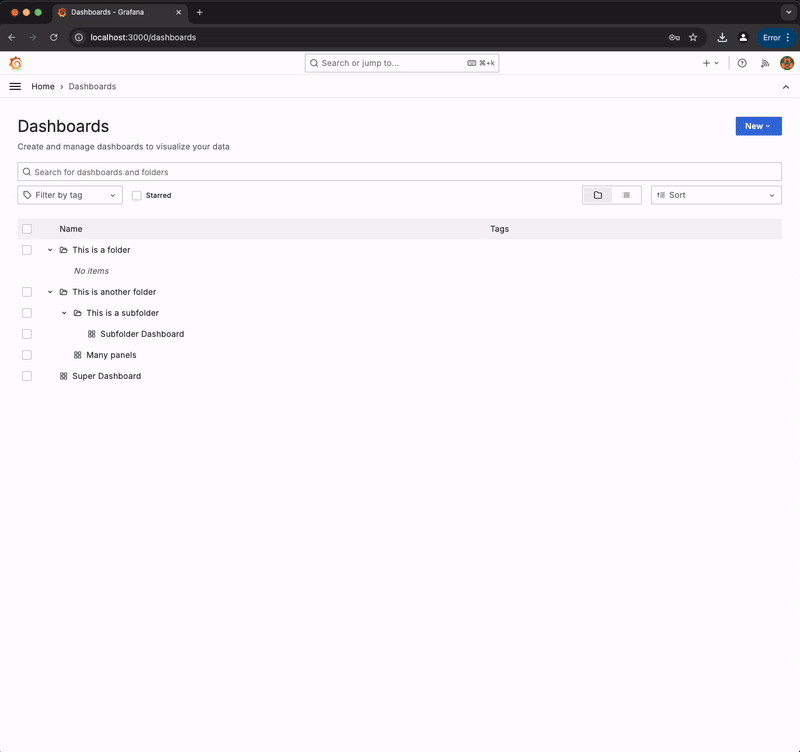

# Grafana PDF Reporter

Grafana PDF Reporter is a Go-based service that generates PDF reports from Grafana dashboards. It provides an endpoint to fetch dashboards, panels, and their associated images, rendering them into a single PDF document.

This service is based on Izak Marais' [Grafana reporter](https://github.com/IzakMarais/reporter).

## Features

- Automatically handle Grafana panel images.
- Export and download dashboards as PDF files.
- Customizable dashboard and panel layouts.

## Diagram

  


## Usage

- **Through a Grafana Dashboard**:
  
   1. Go to your dashboard, then **_Dashboard settings/Links_** and click **_+ New Link_**.
   2. Add a title
   3. Select the type _Link_
   4. Add an URL with the format: `http://localhost:9090/api/v1/report/<your_dashboard_uid>/`
   5. Select the options: _Include current time range_ and _Include current template variable values_.
   6. After clicking the link you'll be redirected to a page made out of the Grafana dashboard. There you'll be able to resize, rearrange and then create a PDF file.

  
 
- **Through the Home Page**:
  1. Go to `http://localhost:9090`
  2. You will see a list of dashboards and folders.
  3. Click on your dashboard. Note: The template variable values will be the default ones saved in Grafana.
 
  

## Authentication

- If a Service Account token was added to the config.ini file, the application will try to use it as to authenticate the API calls. *Note: [Grafana Service Accounts](https://grafana.com/docs/grafana/latest/administration/service-accounts/) are organization-bound.*

- If a Service Account token was not added, the application will try to use Grafana's session cookies. For that to work, you'll have to access your Grafana account and then use the application from the same browser. Note: Grafana session cookies expire, so you may need to refresh the Grafana tab and authenticate again if sessions time out.

## Requirements

- **Grafana**: Ensure that Grafana is running and accessible.
- **Grafana Image Renderer Plugin**: This plugin is necessary to render panels as images. You can find the plugin [here](https://grafana.com/grafana/plugins/grafana-image-renderer).

## Setup

The application is designed to be run using Docker. You should change the `docker-compose.yml` to point to your own Grafana instance. However, you can use the provided `docker-compose.yml` for testing purposes. Below are the steps to set up the application using Docker.

### Docker

1. **Clone the Repository**

   ```bash
   git clone https://github.com/tomascastagnino/grafana-pdf-reporter.git
   cd grafana-pdf-reporter
   ```

2. **Build and Run the Docker Containers**

   Ensure Docker is installed and running on your system. The `docker-compose.yml` file provided in the repository is configured to run the application along with Grafana and the Grafana Image Renderer plugin.

   To build and run the Docker containers:

   ```bash
   docker-compose up --build
   ```

   This command will start the following services:

   - **Grafana**: Accessible at `http://localhost:3000`
   - **Grafana Image Renderer**: Runs in the background to render images of Grafana panels.
   - **Grafana PDF Reporter**: The service itself, accessible at `http://localhost:9090`.

   You can use this setup for testing and development purposes. Adjustments to the `docker-compose.yml` file might be necessary depending on your production environment.

## Endpoints

- **Home Page**: `GET /`
- **Dashboard List**: `GET /api/v1/dashboards`
- **Fetch Dashboard**: `GET /api/v1/dashboard/{dashboard_id}`
- **Fetch Panel Image**: `GET /api/v1/dashboard/{dashboard_id}/panel/{panel_id}`
- **Export as PDF**: Accessible via the web interface.
